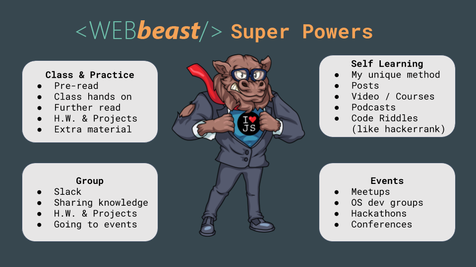
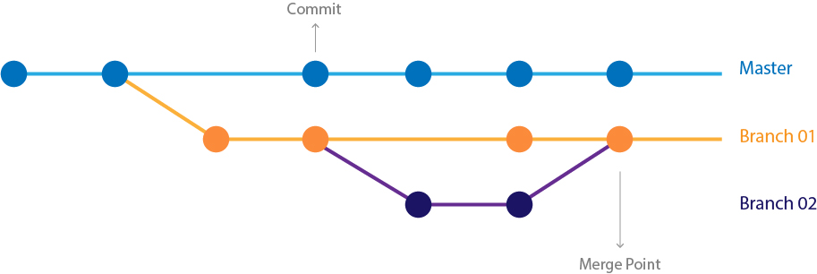
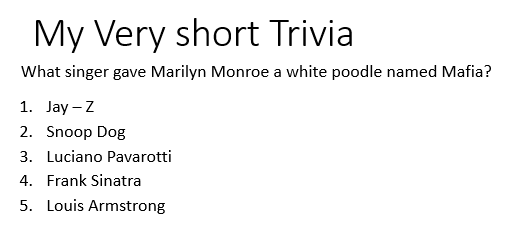

## Module 1 Lesson 01
### Web Introduction
(This document optimized for [reveal-md](https://github.com/webpro/reveal-md))

---

## Goal
Explain the course system + Wrap up what you did in the intro-module

### Agenda
- How the program works
- Hello git (rainbow practice)
- ***Break & mingling***
- Hello HTML + CSS
- Hello Javascript


---

### How the program works
It's all about building a (learning) system... that works!

<div>
    
</div>

---

### Hello Git
[Quick reminder - Git core (0:00 - 3:00)](https://www.youtube.com/watch?v=_ALeswWzpBo)
<div style="float: left">
    
</div>

---

### Hello Git - Creating a Repo
1. git init
2. git status
3. create a file named: 1.txt
4. git status
5. git add 1.txt
6. git status
7. git commit -m "first commit"

Practice: add 2 more files and commit

---

### Hello Git - Checkout & Branches
1. git [log](https://git-scm.com/book/en/v2/Git-Basics-Viewing-the-Commit-History)
2. git [checkout <CHECKSUM>](https://git-scm.com/docs/git-checkout)
3. see what happen (dir/ls)
4. read [DETACHED HEAD](https://git-scm.com/docs/git-checkout#_detached_head)
4. git checkout master
5. see what happen (dir/ls)
6. git branch
7. git checkout -b branch1

Practice: add a file and commit *branch1*. switch between branched

---

### Hello Git
[Quick reminder - Git core (0:00 - 3:00)](https://www.youtube.com/watch?v=_ALeswWzpBo)
<div style="float: left">
    
</div>
Review terms:

commit, branch, master, HEAD, checkout, merge, local repository


---

### Hello Git - Github
[Quick reminder - Git & github (3:00 - 5:00)](https://youtu.be/_ALeswWzpBo?t=182)

important terms:
- current branch / HEAD (not the same thing...)
- clone
- pull / push
- downstream / upstream
- stash
- fork
- [conflicts](https://help.github.com/articles/resolving-a-merge-conflict-using-the-command-line/)

---

### Hello Git - Working with PRs
1. clone the repo to your local machine:
```
git clone https://github.com/webbeast2019/module1-exercises
```
2. create branch:   ***git checkout -b rainbow(yuval)***
3. make changes
4. add changes to git:    ***git add -A***
5. commit changes: ***git commit -m "Adding yuval's info"***
6. push to your repo:  ***git push origin rainbow(yuval)***
   Or:  ***git push origin HEAD***
8. open PR to master (from github website)

---

### Hello git - Working with PRs
keep in mind:
- change only your card content (you can add images)
- have a unique branch name (use your name)
- for now, avoid manual [merge](https://www.youtube.com/watch?v=AqocDsE_32c)
- A word about `.gitignore`

---

### <a href="./demo/m1.lesson01/my-first-page.html" target="_blank">Hello HTML</a>
HTML rules and semantics
- they are so many of them... don't get confused!
- [doctype](https://www.w3schools.com/tags/tag_doctype.asp)
- head ([base](https://www.w3schools.com/tags/tag_base.asp), [meta](https://www.w3schools.com/tags/tag_meta.asp), [title](https://www.w3schools.com/tags/tag_title.asp), [link](https://www.w3schools.com/tags/tag_link.asp), [script](https://www.w3schools.com/tags/tag_script.asp))

---

### <a href="./demo/m1.lesson01/my-first-page.html" target="_blank">Hello HTML</a>
HTML rules and semantics

- body
    - flow ( [block vs inline](https://www.w3schools.com/html/html_blocks.asp) )
    - elements semantics (`a`,`img`, lists, `header`, `footer`, `nav`,`h1`-`h6`, `p`, `i`, `div`, `span` etc)
    - [forms and form-elements](https://stackoverflow.com/questions/3294572/is-input-well-formed-without-a-form) (`button`,`input`, `label`, `select` and more)
    - attributes - some apply for [all HTML elements](https://developer.mozilla.org/en-US/docs/Web/HTML/Global_attributes), some are [element-specific](https://www.w3schools.com/tags/ref_attributes.asp)

---

### Hello CSS
- Cascading means...?
- CSS [selectors and points](https://css-tricks.com/specifics-on-css-specificity/)
- display property (again - block vs inline, none, and more!)
- [box model](https://www.w3schools.com/css/css_boxmodel.asp)


---

### Hello HTML + CSS: Class Practice
Create and style a page which contains:
- head title
- a question line
- 5-8 lines of texts (answer option)
- input + button
<div>
    
</div>


---

### Hello Javascript
- Good practice: `use strict`, always terminate statements; compare by type.
- Data types: Undefined, Null, Boolean, Number, String, Symbol, Object 
- Variables: var / const / let
- Loops: while, for, forEach (avoid using for in)
- Comparing types
- Objects: literals, constructor, nested properties
- Arrays
- Functions
- DOM

---

### Hello Javascript: Class Practice
Add dynamic page render to the Trivia page
Add input with number type, an answer button and correct / wrong indication.

---

### Further read:
1. go through *all* links in today's lesson, research the terms you've learned
2. [Understanding the CSS display property](https://www.creativebloq.com/how-to/understanding-the-css-display-property)
3. checkout what you can do with [css3](http://scottcheng.github.io/revolutionary-css3)
4. Don't forget pre-lesson material!

---

### Home Work:
- weekly task: build and design a web calculator
- fork and PR: ***home-module1-exercises/lesson1-web-calculator***
- [Learn Git Branching](https://learngitbranching.js.org/)

---

### Extra:

- [See reminder GitHub for Noobs - Using the Command Line](https://www.youtube.com/watch?v=JPKOESR1k04)
- [Katakoda interactive git](https://www.katacoda.com/courses/git/)
- [Getting started with git](https://instruqt.com/public/topics/getting-started-with-git)
- If you still feel you lack some basics - see [JS in 12 minutes](https://www.youtube.com/watch?v=Ukg_U3CnJWI)
- Solve levels 1-2 at [checkio](https://checkio.org/)
- Practice on module 0 apps


