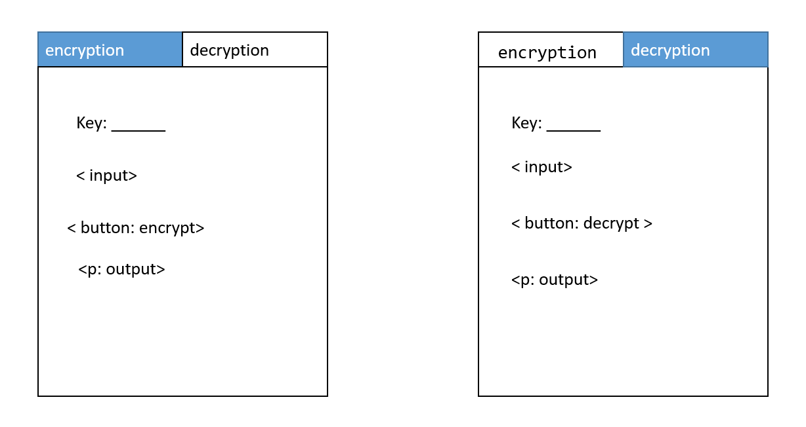
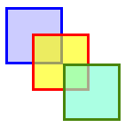

## Module 1 Lesson 02
### CSS 1 & Javascript basics 1
(This document optimized for [reveal-md](https://github.com/webpro/reveal-md))


---

### Prep
- [Basic Concepts of Flexbox](https://developer.mozilla.org/en-US/docs/Web/CSS/CSS_Flexible_Box_Layout/Basic_Concepts_of_Flexbox)

### Agenda
1. Basic DOM manipulation
2. How CSS display elements? (flow, display, positioning)
3. JS basics (flow, types, strings,  Math, Functions)

---

### Basic DOM manipulation

[getElementById](https://developer.mozilla.org/en-US/docs/Web/API/Document/getElementById)
```
    <div id="moshe"></div>
    <script>
        document.getElementById('moshe').innerHTML = 'moshe';
        // or
        document.querySelector('#moshe').innerHTML = 'moshe';
    <script>
```

querySelector works like css selectors!
try: 
```
    document.querySelector('element.class');
```
<!-- .element: class="fragment" -->

---

### Basic DOM manipulation
[getElementsByClassName](https://developer.mozilla.org/en-US/docs/Web/API/Document/getElementsByClassName)
``` 
    <div class="moses" id="moshe1"></div>
    <div class="moses" id="moshe2"></div>
    <script>
        const moses = document.getElementsByClassName('moses');
        moses[0].style.backgroundColor = 'red';
    <script>
```
Other multi-elements Selector works in the same way (like: [getElementsByTagName](https://developer.mozilla.org/en-US/docs/Web/API/Document/getElementsByTagName))


Short exercise: how to do [ForEach on node elements](https://stackoverflow.com/questions/24775725/loop-through-childnodes)?
- Create a ul with 10 li elmements
<!-- .element: class="fragment" -->
- Use javascript to set each li content (index + ' mississippi')
<!-- .element: class="fragment" -->

---

### How CSS display elements? - flow
inline (actually display:inline is not needed here.. why?)
```
<span style="display:inline; border:dotted;">Content 1</span> 
<span style="display:inline; border:dotted;">Content 2</span> 
```
<span style="display:inline; border:dotted;">Content 1</span> 
<span style="display:inline; border:dotted;">Content 2</span> 
<hr>
block
```
<span style="display:block; border:dotted;">Content 1</span> 
<span style="display:block; border:dotted;">Content 2</span> 
```
<span style="display:block; border:dotted;">Content 1</span> 
<span style="display:block; border:dotted;">Content 2</span> 

---
### How CSS display elements? - display
inline-block (inline with block sizing capabilities)
```
<span style="display:inline-block; border:dotted; height:100px; width:100px;"></span>
<span style="display:inline-block; border:dotted; height:100px; width:100px;"></span>
```
<span style="display:inline-block; border:dotted; height:100px; width:100px;"></span> 
<span style="display:inline-block; border:dotted; height:100px; width:100px;"></span> 

display:none will - remove it from the flow (while `visibility:hidden` will just hide it)

---
### How CSS display elements? - display
[flex](https://developer.mozilla.org/en-US/docs/Web/CSS/CSS_Flexible_Box_Layout/Basic_Concepts_of_Flexbox)
```
<div style="display:flex">
    <div style="display:inline; border:dotted;">Content 1</div>
    <span style="display:inline; border:dotted;">Content 2</span>
</div>
```
<div style="display:flex">
    <div style="display:inline; border:dotted;">Content 1</div>
    <span style="display:inline; border:dotted;">Content 2</span>
</div>

So many options for this property...
try <!-- .element: class="fragment" --> and play with [display](https://www.w3schools.com/cssref/pr_class_display.asp)

---

### How CSS display elements? - [positioning](https://developer.mozilla.org/en-US/docs/Web/CSS/position)
 - static: by default
 - relative: relative to its normal position
```
<div style="border:dotted;">Content1</div> 
<div style="position:relative; border:dotted; left:30px">Relative</div> 
```
<div style="border:dotted;">Content1</div> 
<div style="position:relative; border:dotted; left:30px">Relative</div> 
---

### How CSS display elements? - [positioning](https://developer.mozilla.org/en-US/docs/Web/CSS/position)
 fixed: relative to the viewport
 ```
    <div style="border:dotted; position:fixed; top:30px">Fixed</div> 
 ```
<div style="border:dotted; position:fixed; top:30px">Fixed</div> 
 
 <hr>
 
 absolute: relative to nearest positioned ancestor
 
```
    <div style="border:solid; position:relative; height: 100px>
        <div style="border:dotted; position:absolute; top:30px">Absolute<div>
    </div> 
```

<div style="border:solid; position:relative; height: 100px">
    <div style="border:dotted; position:absolute; left: 50px; top:15px">Absolute<div>
</div> 
    
---

### How CSS display elements: Practice

Build page with 2 tabs
<div style="height:220px">
    
</div>

Bonus:
above the tabs section, add the following logo using only 3 divs + css 
<div>
    
</div>
---

### JS basics 
 - flow
 - [switch](https://www.w3schools.com/js/js_switch.asp)
 - [strings](https://developer.mozilla.org/en-US/docs/Web/JavaScript/Reference/Global_Objects/String) (and [regex](https://regexone.com/))
 - [Math](https://developer.mozilla.org/en-US/docs/Web/JavaScript/Reference/Global_Objects/Math)
 - Object types
 - Functions

Live code demo

---

### JS basics: practice 
Caesar code encryption / decryption page

use tab for Caesar encryption decryption and send messages ro each other via slack(key is 1to26, hi/low case?)

---
### Further reading
1. [Css3 flexbox](https://www.w3schools.com/css/css3_flexbox.asp)
2. [A Complete Guide to Flexbox](https://css-tricks.com/snippets/css/a-guide-to-flexbox/)
2. [Flexbox Cheatsheet](https://darekkay.com/dev/flexbox-cheatsheet.html)
3. Css [positioning](https://developer.mozilla.org/en-US/docs/Web/CSS/position)

---
### Home Work:
continue with web calculator

### Extra
1. [regex tutorial](https://regexone.com/)
2. Use my-first-page.html from last lesson Add a script which change the color of all the text in the page. do not use inline styles.
