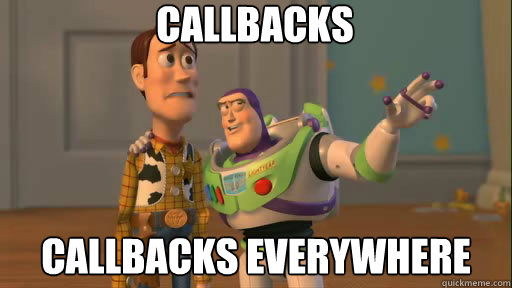

## Module 1 Lesson 05
### Intro to NodeJS and Server side
(This document is optimized for presentation using [reveal-md](https://github.com/webpro/reveal-md))

---

## Overview
Introduction to Client-Server Architecture and NodeJS based Server 

### Agenda

1. Client-Server Architecture
2. NodeJS introduction
3. Basic node server
4. Using query parameters

---

### [Client-Server](https://en.wikipedia.org/wiki/Client%E2%80%93server_model) Architecture

- [Architecture](https://www.quora.com/What-is-the-difference-between-architecture-and-protocol-software):  It's a model, not implementation
<!-- .element: class="fragment" -->

- This model can be used for providing web services, serve files, network printing etc. 
<!-- .element: class="fragment" -->

- [Client And Server](https://en.wikipedia.org/wiki/Client%E2%80%93server_model)
Have specific roles: The first request resources, while the last provide them
<!-- .element: class="fragment" -->


---

### [Client-Server](https://en.wikipedia.org/wiki/Client%E2%80%93server_model) Architecture

- Server manage (and share) resources to provide request from different clients.
clients do not share resources directly with other clients (on different machines).
<!-- .element: class="fragment" -->

- The term Server may refer to<!-- .element: class="fragment" -->:
    - A role in Client-Server model <!-- .element: class="fragment" -->
    - A software implementation / instance <!-- .element: class="fragment" -->
    - A physical machine <!-- .element: class="fragment" -->

- Nowadays [cloud services](https://www.youtube.com/watch?v=jOhbTAU4OPI) provide easy and cheap way to operate web servers
<!-- .element: class="fragment" -->

---

### NodeJS introduction

 - NodeJS: use javascript outside browser
 <!-- .element: class="fragment" -->

 - node works with modules. like: 
 <!-- .element: class="fragment" -->
```js
    const http = require(http);
```
<!-- .element: class="fragment" -->

 - Let's [install node LTS](https://nodejs.org/en/) and run some scripts
<!-- .element: class="fragment" -->
``` terminal
    // to run a js file write in terminal
    node myfile.js
```
<!-- .element: class="fragment" -->
---

### NodeJS introduction

 - Create js file with the following functions (and some tests) and run it with node:
    <!-- .element: class="fragment" -->
    - highReverse(input): return reversed input string, in High case letters
<!-- .element: class="fragment" -->
    - countSubStr(input, sub): count how many times sub exist in input
<!-- .element: class="fragment" -->
 
---

### [Basic node server](https://www.w3schools.com/nodejs/default.asp)
Most basic server
```js
// see simple-static-server1.js
const http = require('http');

http.createServer(function (req, res) {
    res.writeHead(200, {'Content-Type': 'text/plain'});
    res.end('Hello World!');
}).listen(8080);

```
---

### Basic node server: 

When working with node server - better get used to this pattern
<div>
    
</div>


---

### Basic node server: [File serving](https://www.w3schools.com/nodejs/nodejs_filesystem.asp)

Basic File server

```js
// see simple-static-server2.js
const http = require('http');
const fs = require('fs');

http.createServer(function (req, res) {
    fs.readFile('demofile1.html', function(err, data) {
        res.writeHead(200, {'Content-Type': 'text/html'});
        res.write(data);
        res.end();
    });
}).listen(8080, function () {
    console.log('Client is available at http://localhost:8080');
});


```

---

### Basic node server
- Live Demo
- Practice: 
    - create a basic file server
    - serve html file with simple GUI: 
        - a row with input and a button
        - a row with 2 inputs and a button
    - Integrate the 2 functions you've created previously in this GUI
    - Note your Content-Type


---

### Basic node server
Node [debugging with VS code](https://code.visualstudio.com/docs/nodejs/nodejs-tutorial)

---

### Using query parameters
- query parameters can be used to transfer small data in **non-secure** manner
- used in routing, search results, basic config etc.
- can be parsed using [URL module](https://www.w3schools.com/nodejs/nodejs_url.asp),
which has similar properties to *window.location*

---

### Practice: Flights server stage 1
- create a server than can serve html, css, js, json files
- file can be accessed only if it's in `public` folder


---

### Practice: Flights server stage 2
- work in teams of 2 people
- No. 1 will build Flights server side (Data and data filter by to/from)
- No. 2 will build Flights client side (Flights table, sorting, time limit etc.)
- Both team members should understand all of the code
- JSON format example can be found in the demo folder
- Task will be continued on the next lesson - be prepared!

---

### Recap
- We've created static server based on [Pure nodeJS](https://developer.mozilla.org/en-US/docs/Learn/Server-side/Node_server_without_framework)
- What next?
    - Modules
    - Node
    - Express server (module 3)
---

### Further reading
* [Node.js Tutorial For Absolute Beginners](https://www.youtube.com/watch?v=U8XF6AFGqlc)
* [blocking-vs-non-blocking](https://nodejs.org/en/docs/guides/blocking-vs-non-blocking/)


---

### Home Work:
* Continue working on flights app in pairs, teams will demonstrate on next lesson.

### Extra:
Improve find-a-pair cards game:
* add best score (minimum time OR minimum tries)
* add server to cards game (Serve files + best score)