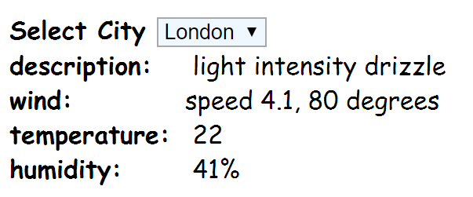

## Module 1 Lesson 09
### Working with API: leaflet & OpenWeatherAPI
(This document is optimized for presentation using [reveal-md](https://github.com/webpro/reveal-md))

---

### Prep
* [How to use Git inside of VSCode](https://www.youtube.com/watch?v=6n1G45kpU2o)
* [Leaflet - Create a map with a marker](https://www.youtube.com/watch?v=wVnimcQsuwk)

### Agenda
1. Git GUI tools
1. The concept of API
2. Web API 1: OpenWeatherMap
3. Web API 2: Leaflet

---

### Git GUI tools
* [VSCode Git tools](https://www.youtube.com/watch?v=VOwyH2-VCVY)
    * Command menu can be accessed using the top "View" tab > command pallete
<!-- .element: class="fragment" -->

* VSCode Extension - Git Graph
<!-- .element: class="fragment" -->

* Explore extensions by yourself :)
<!-- .element: class="fragment" -->

---

### The concept of API
* [API](https://www.youtube.com/watch?v=s7wmiS2mSXY) - how programs "talk" to each other
<!-- .element: class="fragment" -->

* A set of commands provided by developers, for higher-level developers
<!-- .element: class="fragment" -->

* Not only for the WEB - [Programming Languages](https://docs.oracle.com/javase/7/docs/api/) and [Code Libraries](http://api.jquery.com/) have API, [OS](https://www.kernel.org/doc/html/v4.12/core-api/kernel-api.html), [firmware](https://developer.nvidia.com/nvapi) etc.
<!-- .element: class="fragment" -->

* You've already used it [before](https://jsonplaceholder.typicode.com)
<!-- .element: class="fragment" -->

* [WEB API != REST != HTTP](https://stackoverflow.com/questions/28703093/what-exactly-is-the-difference-between-web-api-and-rest-api-in-mvc)
<!-- .element: class="fragment" -->

---

### API 1: [OpenWeatherMap](https://openweathermap.org/api)
* [Sign up](https://home.openweathermap.org/users/sign_up)
* Get [API token](https://home.openweathermap.org/api_keys)
* [Try it!](https://openweathermap.org/current)
* Note: follow the spec. use ***api.openweathermap.org*** not ***sample.openweathermap.org***

---

### API 1: OpenWeatherMap - practice
create a mini-app which display the weather in 5 cities around the world.

    

bonus: add requests [caching](https://whatis.techtarget.com/definition/caching) mechanism

---

### API 2: [Leaflet](http://leafletjs.com/)
* Sign up
* Get token API
* Work according to the [Quick Start Guide](http://leafletjs.com/examples/quick-start/)

---

### API 2: Leaflet - practice
* Add a map to your weather mini-app
* Put blue markers on each city in the list
* When a city selected:
    - Change the selected marker color
    - Center map on the selected marker

---
### Further reading
* [Introduction To Leaflet](https://www.youtube.com/watch?v=6QFkgOeQc0c)

### HW
* Finish class practice at home (Will Evolve into level-1 project)
