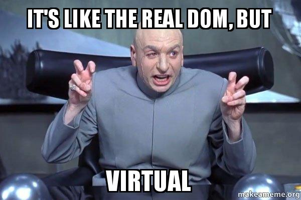
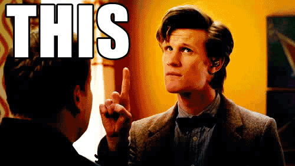

## Module 2 Lesson 2
### React Basics 1
(This document is optimized for presentation using [reveal-md](https://github.com/webpro/reveal-md))

---

### Prep
* [React JS Tutorial (1:35:00 - 2:00:00)](https://www.youtube.com/watch?v=UtIOMUQ7nWM)

### Agenda
1. More About React (VDom, React Fiber, class/fn, props/state)
2. Create react app
3. State and Events

---

### More About React

Virtual DOM (See further reading section)

    

<!-- .element: class="fragment" -->

* React Elements are much cheaper than actual DOM nodes.
* Keys - should be unique and consistent

<!-- .element: class="fragment" -->

---

### More About React
* React Fiber (See further reading section)
* Components:
    * Class vs Functional
    * Props vs State
    * Class with props - remember ***this***?
    

        
    

    <!-- .element: class="fragment" -->

---

### Create React App
* See the<!-- .element: class="fragment" --> [Docs](https://github.com/facebook/create-react-app)

* A word about <!-- .element: class="fragment" --> [npx](https://blog.npmjs.org/post/162869356040/introducing-npx-an-npm-package-runner)

---
### Create React App
The Toolbox (and what each tool do:)
* Package management - npm
<!-- .element: class="fragment" -->
* Bundler <!-- .element: class="fragment" --> - [webpack](https://webpack.js.org/)

* Transpiler/Compiler - babel (JSX/TS/es6 to es5)
<!-- .element: class="fragment" -->

* Typescript & ES modules
<!-- .element: class="fragment" -->

create-react-app uses webpack and babel under the hood -
you most likely never touch them directly!
<!-- .element: class="fragment" -->

---
### Create React App
Practice: Lets create an app and explore it
* Using npx is a better option than global installation
* Use typescript
* Explore project structure

---
### Create React App
Practice: Move the todo-app code from last class into the app you'ev just created

---
### [State](https://reactjs.org/docs/state-and-lifecycle.html) and [Events](https://reactjs.org/docs/handling-events.html)
Practice: Repo - react-todo-list  
Requirements - The user should be able to:
* Add new todo item (with text provided by the user)
* Mark the items as "Completed"
* Mark the items as "Favorite"
* Filter: Show All / Completed / Uncompleted / Favorite items
* Counter: Show number of items per filter

---

### Further reading
* [What is the Virtual DOM?](https://www.youtube.com/watch?v=d7pyEDqBDeE)
* [Brief Overview of React Fiber](https://www.youtube.com/watch?v=0fUmOPQUv-Q)

---
### Home Work:
* Finish [React official Intro (tic - tac - to)](https://reactjs.org/tutorial/tutorial.html)
* Finish watching [React JS Tutorial](https://www.youtube.com/watch?v=UtIOMUQ7nWM)

### Extra - Todo app
html `<title>` should contain the name and counter of the active filer, examples:
* Todo:All(8)
* Todo:Completed(2)