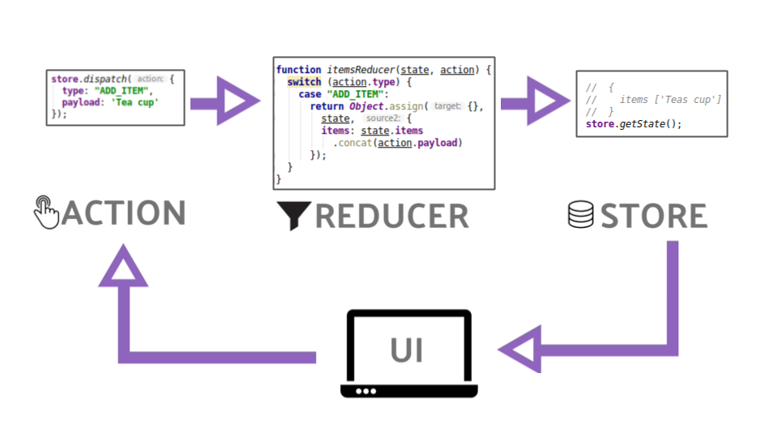

## Module 2 Lesson 5
### Let's build redux!
(This document is optimized for presentation using [reveal-md](https://github.com/webpro/reveal-md))

---

### Prep
* [Redux Explain in a simple way](https://www.youtube.com/watch?v=nFryvdyMI8s)

### Agenda
1. The problem with large scale applications
2. What is Redux?
3. Let's Build Redux
4. Redux middlewares

---

### Problems when apps go large
* As application grows so their complexity.
<!-- .element: class="fragment" -->

* Multiple Components may use the same data. As application grows, services may not be enough.
<!-- .element: class="fragment" -->

* Multiple Components affect the same data (and each other).
They may be in different parts of the app (not always parent child)
<!-- .element: class="fragment" -->

* Spaghetti code create debug hell
<!-- .element: class="fragment" -->

* Saving application state (for later load) seems to be problematic in large apps.
<!-- .element: class="fragment" -->

---

### What is Redux?

* A design pattern (based on flux)
<!-- .element: class="fragment" -->

* redux.js - A Library which implement that design pattern
<!-- .element: class="fragment" -->

* Idea is: let's manage single source of truth, in a predictable way
<!-- .element: class="fragment" -->

* Redux dictate how to store and change your data, in a loose way
(Has Principles and best practices, but does not enforce them)
<!-- .element: class="fragment" -->

---

### What is Redux? - scheme

* store - manage your stuff
* state - object represent app in a specific time
* action - plain object represent an event
* reducer - transform old state + action to a new state

---

### What is Redux? - scheme

---

### What is Redux?
[Redux Explained in a simple way](https://www.youtube.com/watch?v=nFryvdyMI8s)
<iframe width="640" height="480"
src="https://www.youtube.com/embed/nFryvdyMI8s" allowfullscreen>
</iframe>

---

### What is Redux? - Rules

* <!-- .element: class="fragment" -->
Principles 1: [Single source of truth](https://redux.js.org/introduction/three-principles#single-source-of-truth)
* <!-- .element: class="fragment" -->
Principles 2+3: [States are immutable](https://redux.js.org/introduction/three-principles#single-source-of-truth)

* <!-- .element: class="fragment" -->
Best Practice #1: Seperate data and UI state
* <!-- .element: class="fragment" -->
Best Practice #2: Keep a flat data structure (like a database)

---

### Let's Build Redux
Live coding and practice
(files in demo library)

---

### Redux [middleware](https://redux.js.org/advanced/middleware)

<!-- .element: class="fragment" -->

Live coding and practice
<!-- .element: class="fragment" -->

---

### Further reading
* [Redux - motivation](https://redux.js.org/introduction/motivation)
* [Redux - getting-started](https://redux.js.org/introduction/getting-started)
* [middleware](https://redux.js.org/advanced/middleware)

---

### Homework
* Finish class practices
* If you missed class practice - try and build redux yourself using the snippets
