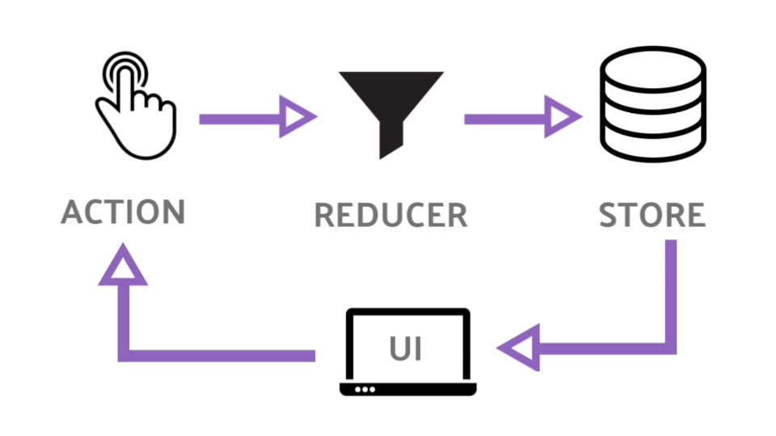

## Module 2 Lesson 6
### React with redux
(This document is optimized for presentation using [reveal-md](https://github.com/webpro/reveal-md))

---

### Prep
* [React-with-Redux part 1](https://www.youtube.com/watch?v=eT7Pk7rOb2c)
* [React-with-Redux part 2](https://www.youtube.com/watch?v=86q4LyE8h3E)
* [React-with-Redux part 3](https://www.youtube.com/watch?v=V-WtkWvJyK4)
* [React-with-Redux part 4](https://www.youtube.com/watch?v=V-WtkWvJyK4)

### Agenda
1. What is Redux? - a Reminder
2. Motivation for adding redux
3. React with redux

---
### What is Redux? - a Reminder

* store - manage your stuff
* state - object represent app in a specific time
* action - plain object represent an event
* reducer - transform old state + action to a new state

---
### Motivation for adding redux

* State management (Not only redux) help us managing app data 
and state without passing states/props all over.
<!-- .element: class="fragment" -->

* State management make app predictable.
<!-- .element: class="fragment" -->

* Multiple Components may use the same data.
<!-- .element: class="fragment" -->

* Multiple Components may use the same data.
<!-- .element: class="fragment" -->

* Application state can be saved for later load.
<!-- .element: class="fragment" -->

* <!-- .element: class="fragment" -->
Redux considered as the industry standard as react state management.

---

### React with redux
Live demo and Practice
(connect redux to Trivia app)

---

### Further reading
* [React-with-Redux part 5](https://www.youtube.com/watch?v=xBYKraiCHVA)
* Research: why state immutability is important?

---

### Homework
* Finish implementing react-redux with multiple reducers
* Implement what you've learn on PlayBuzz project