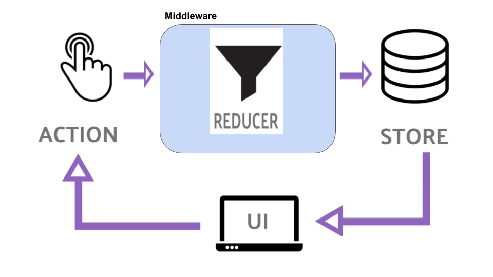

## Module 2 Lesson 9
### Fetching Data in React

(This document is optimized for presentation using [reveal-md](https://github.com/webpro/reveal-md))

---
    
### Prep
* [How to fetch data in React](https://www.robinwieruch.de/react-fetching-data/)
* 

### Agenda
1. Where & When?
2. Loading Indication
3. Fetch & Store
4. API middleware
5. Thunk and Sagas

---

### Where & When?
Where - possible strategies
* Components fetch their own data
<!-- .element: class="fragment" -->

* First parent of children requiring the data
<!-- .element: class="fragment" -->

* App / Root component
<!-- .element: class="fragment" -->

* Redux
<!-- .element: class="fragment" -->

---

### Where & When?
When - possible strategies
* On load
<!-- .element: class="fragment" -->

* On demand 
<!-- .element: class="fragment" -->

* Periodically / on update (polling / websocket)
<!-- .element: class="fragment" -->


---

### Loading Indication
* Always indicate about loading
<!-- .element: class="fragment" -->

* Avoid multiple spinners - prefer single loader on parent component
<!-- .element: class="fragment" -->

* Loader vs Progress indicators strategies
<!-- .element: class="fragment" -->

* <!-- .element: class="fragment" --> [Spinner vs bars](https://material-ui.com/components/progress/)


---

### Fetch & Store
Practice - step 1:
1. Move data to external `json` file
2. Fetch on App component
3. Save to store
4. Add a loading indication (spinner)


---

### API middleware


---

### API middleware


---


### API middleware
```
const logger = (store) => (next) => (action) =>  {
  console.log('action fired', action);
  next(action);
}
```
* Reminder: It's a like a plug-in which wrap our dispatch
* [Demo](https://www.youtube.com/watch?v=DJ8fR0mZM44)

---

### API middleware
Practice - step 2:
* Add a logger middleware (live demo)
* Add an API middleware
* Use API middleware to fetch data
* Use Same API middleware store the data (fire another action)

---

### API middleware
Reducers should be pure, Thus *Middleware* should hold most of redux logic

Middleware can 
* Fire actions
* Fetch data
* Route logic flow(fire data according to state / action)

---

### API middleware
Practice - step 3:

Split API middleware to:
* Fetch middleware
* Success/Fail Middleware

---

### Thunk and Sagas
* [Redux-Thunk](https://github.com/reduxjs/redux-thunk)
* [Redux-Saga](https://github.com/redux-saga/redux-saga)

---

### Further reading
* [How to fetch data with React Hooks?](https://www.robinwieruch.de/react-hooks-fetch-data/)
* [How to fetch data inside react apps](https://itnext.io/how-to-fetch-data-inside-react-apps-2ca430c202c5)
* [create-react-app Docs about fetching data](https://facebook.github.io/create-react-app/docs/fetching-data-with-ajax-requests)
* [Patterns for data fetching in React](https://blog.logrocket.com/patterns-for-data-fetching-in-react-981ced7e5c56/)
* [Redux-Thunk vs. Redux-Saga](https://decembersoft.com/posts/redux-thunk-vs-redux-saga/)

---
### Home Work:
* Finish class practice
* Fetch data on project 2

### Extra
* Investigate demo project