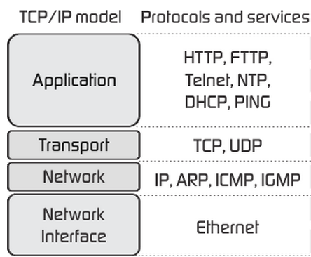

## Module 3 Lesson 7
### More about Network Protocols
(This document is optimized for presentation using [reveal-md](https://github.com/webpro/reveal-md))

---

### Prep

### Agenda
1. TCP/IP
2. Websocket
3. HTTPS
4. HTTP2

---
### The 4 layers model


---
### [TCP/IP](https://he.wikipedia.org/wiki/TCP/IP)
* <!-- .element: class="fragment" -->[TCP: Transmission Control Protocol](https://he.wikipedia.org/wiki/Transmission_Control_Protocol) (vs UDP - User Datagram Protocol)

* Provides a communication service at an intermediate level between an application program and the Internet Protocol (IP)
<!-- .element: class="fragment" -->
* Creat connection (handshake), splite data into packets and provide reliable transmission
<!-- .element: class="fragment" -->
* <!-- .element: class="fragment" -->[IP: Internet Protocol](https://he.wikipedia.org/wiki/Internet_Protocol)
* Fast protocol (do not insure reliablity).
<!-- .element: class="fragment" -->

---
### IP address
* <!-- .element: class="fragment" -->IPv4 vs IPv6
```
192.168.0.1                 //IPv4
FE80::0202:B3FF:FE1E:8329   //IPv6
```
* Private IP vs Public IP
<!-- .element: class="fragment" -->
* <!-- .element: class="fragment" -->[NAT: Network Address Translation](https://www.youtube.com/watch?v=QBqPzHEDzvo)
* <!-- .element: class="fragment" -->[Subnet mask](https://he.wikipedia.org/wiki/Subnet_mask)

---
### Websocket
* providing full-duplex communication channels over a single TCP connection
<!-- .element: class="fragment" -->
* It is NOT the same as HTTP. it is HTTP compatible.
<!-- .element: class="fragment" -->

---
### Websocket - practice
Build a simple chat:
* home page: user can type a name and click a "join chat" button
* chat room: contain conversation area, text area and "send" button
* use [socket.io](https://socket.io/) for all chat communication
* Bonus: remove user from chat room if user disconnected
* Bonus: upload to github + deploy to server on heroku / firebase

---
### [HTTPS](https://he.wikipedia.org/wiki/HTTP_Secure)

<iframe width="560" height="315" src="https://www.youtube.com/embed/w0QbnxKRD0w" frameborder="0" allow="accelerometer; autoplay; encrypted-media; gyroscope; picture-in-picture" allowfullscreen></iframe>

---
### [HTTPS](https://he.wikipedia.org/wiki/HTTP_Secure)
* HTTP Secured
<!-- .element: class="fragment" -->
* HTTP + TSL/SSL = HTTPS
<!-- .element: class="fragment" -->
* If everybody can listen to data traffice - How does it works?
<!-- .element: class="fragment" -->
* <!-- .element: class="fragment" -->[HTTPS uses asymmetric key](https://www.youtube.com/watch?v=w0QbnxKRD0w)

* Provide protection against eavesdropping and Tampering
<!-- .element: class="fragment" -->
* Does not protect against Man in the middle attack
<!-- .element: class="fragment" -->

---

### [HTTP2](https://www.youtube.com/watch?v=jhqrRT4fvOA)
<iframe width="560" height="315" src="https://www.youtube.com/embed/jhqrRT4fvOA" frameborder="0" allow="accelerometer; autoplay; encrypted-media; gyroscope; picture-in-picture" allowfullscreen></iframe>

---
### [HTTP2](https://www.youtube.com/watch?v=jhqrRT4fvOA)
* HTTP2 is improvement of  the original HTTP1 protocol (SPDY based)
<!-- .element: class="fragment" -->
* Support all HTTP v1 features
<!-- .element: class="fragment" -->
* All you need is a browser + server support. Most code stays the same.
<!-- .element: class="fragment" -->
* Uses <!-- .element: class="fragment" -->[streams](https://www.youtube.com/watch?v=BF7uv5fs440)
* Upgrades:<!-- .element: class="fragment" -->
    * Multiple requests per TCP connection (no limit of simulation requests, faster)
    * Binary Protocol, HPACK
    * Server Push

---
### Further read
* [Internet protocol suite](https://he.wikipedia.org/wiki/TCP/IP)
* [How Network Address Translation Works](https://www.youtube.com/watch?v=QBqPzHEDzvo)
* [Rapid Explanation of Subnet Masks](https://www.youtube.com/watch?v=IDLrt-yppbI)
* [HTTPS](https://www.youtube.com/watch?v=w0QbnxKRD0w)

### Extra
* [TCP/IP and Subnet Masking](https://www.youtube.com/watch?v=EkNq4TrHP_U)
* [What is HTTP2?](https://kinsta.com/learn/what-is-http2/)
* [HTTP2 in hebrew](https://www.upress.co.il/blog/post/http2/)
* [HTTP2 In NodeJS Core](https://www.youtube.com/watch?v=BF7uv5fs440)
