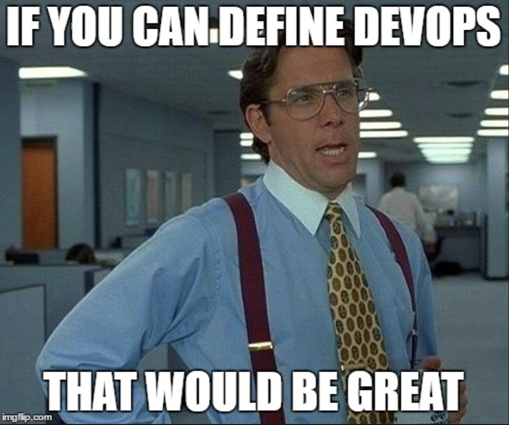
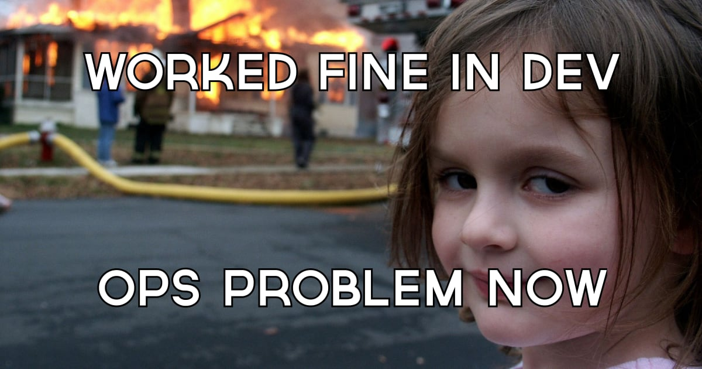

## Module 4 Lesson 2
### Deployment And CI/CD
(This document is optimized for presentation using [reveal-md](https://github.com/webpro/reveal-md))

---

### Prep
1. Create an account on heroku
2. Install Heroku CLI

### Agenda
1. Deployment
2. DevOps 
3. Deployment Environments
4. Letters and Meanings
5. CI/CD with Heruko
6. Let's talk CI

---
### Deployment
Practice - deploy using Heroku CLI
* create repo for a node server 
* Read about [process.env.PORT](https://stackoverflow.com/questions/15693192/heroku-node-js-error-web-process-failed-to-bind-to-port-within-60-seconds-of)
* Follow [Heruko getting-started-with-nodejs](https://devcenter.heroku.com/articles/getting-started-with-nodejs)
steps 1-5

---

### Deployment
Heroku provide different deployment options:
* Using Git + Heroku CLI
* Using Github integration
* Using Docker (New in Heroku)

A word about PaaS and IaaS

---

### DevOps


---
### DevOps
The process of Getting new Idea (new code) out to the world (production server).

DevOps Deals with connecting Development and Operation... what can be confederated as "Operation"?
* Everything between you and production: Build, Auto-Testing, QA etc. 
* Logs and Clients Feedback (Which prioritize task for next sprint)
* The goal: shorten development life cycle


---
### DevOps
DevOps should look for
- Re-work (deployment)
- Overhead (deployment complexity)


---

### [Deployment Environments](https://en.wikipedia.org/wiki/Deployment_environment)
* ***Local*** - Developer's desktop/workstation
* ***Dev*** - Development server, where testing is performed by the developer
* ***QA*** -  where testing is performed by QA
* ***Stage*** - Pre-production, Mirror of production environment, display application to product team/roles before deployment
* ***Production/Live*** - Serves end-users/clients

---
### DevOps
DevOps & Automation
<div>

</div>

---
### Letters and Meanings
* ***CI*** (Continuous Integration) - Automated process which integrate code on each change (Commit)
<!-- .element: class="fragment" -->

* ***CD*** (Continuous Delivery) - The Capability to deploy an Environment at any given time
<!-- .element: class="fragment" -->

* ***CD*** (Continuous Deployment) - Automated process which deploy on each code change (Commit)
<!-- .element: class="fragment" -->

* ***ACDC*** (???)
<!-- .element: class="fragment" -->


<!-- .element: class="fragment" -->


---

### Continuous Integration, Delivery and Deployment
<iframe width="560" height="315" src="https://www.youtube.com/embed/xSv_m3KhUO8" frameborder="0" allow="accelerometer; autoplay; encrypted-media; gyroscope; picture-in-picture" allowfullscreen></iframe>

---

### CI/CD with [Heruko](https://devcenter.heroku.com/articles/getting-started-with-nodejs)
Make sure to use [process.env.PORT](https://stackoverflow.com/questions/15693192/heroku-node-js-error-web-process-failed-to-bind-to-port-within-60-seconds-of)

---
### CI/CD 
Auto Deploy from master 
* Create / Fork [simple node project](https://github.com/webbeast2019/hello-cicd-backend)
* Add auto deployment [connect to github](https://devcenter.heroku.com/articles/github-integration#automatic-deploys) (app dashboard > deploy > deployment methods)
* After connected to github repo, Enable Automatic deploys
* Test by merging a new PR

---
### CI/CD 
Add Production Environment and Delivery on demand
* add new pipeline (my-app-deployment)
* production >  add app... > create new app (my-app-production)
* For deploying staging app to production click "Promote"
* See "Activity" Tab
* Test by merging a new PR, followed by promoting manually to production

---
### CI/CD - Add review apps
* from pipeline view "enable review apps"
* add app.json and commit to repo
* enable "create new reviews ... Automatically"

---
### CI/CD 
Add frontend project
* Create / Fork [frontend project](https://github.com/webbeast2019/hello-cicd-frontend)
* Start the app. node local and production proxy configs
* Install express on frontend project, create simple static express server (don't forget process.env.PORT)
* Test your frontend server (build and serve)

---
### CI/CD 
Deploy frontend project
* Add a main entry in package.json
* npm start should point to server
* Add a postinstall entry in package.json
* Tip: remember to set the correct `homepage` entry in your `package.json`

---
### CI/CD
Deploy frontend project
```js
{
  "name": "hello-cicd-frontend",
  "main": "server/server.js",
  "scripts": {
    "start": "node server/server.js",
    "dev": "react-scripts start",
    "build": "react-scripts build",
    "postinstall": "npm run build"
  }
}
```

---
### Let's talk CI
What we would like our integration service to do?
* Test
* Lint
* Build
* Integration Tasks and Tests


---
### Let's talk CI
Server side testing:
* Add testing using [jest](https://jestjs.io/docs/en/getting-started.html)
* use our [jest-playground](https://github.com/webbeast2019/jest-playground) for jest refreshment

---
### Let's talk CI
Travis
* go to https://travis-ci.org/
* sign in with github, follow [these steps](https://docs.travis-ci.com/user/getting-started/#to-get-started-with-travis-ci)
* add .travis.yml

see also:
https://medium.com/@felipeluizsoares/automatically-deploy-with-travis-ci-and-heroku-ddba1361647f

---
### Let's talk CI
CI => CD

We can provide CI output as CD input
* Make sure travis is working correctly
* Install Travis CLI
* Integrate Travis with heroku according to [the docs](https://docs.travis-ci.com/user/deployment/heroku/)
* Disable Heroku auto-deployment (will be initiated by Heroku)

---
### Further read
* [An Introduction to CI/CD](https://www.digitalocean.com/community/tutorials/an-introduction-to-continuous-integration-delivery-and-deployment)
* [What is DevOps](https://www.youtube.com/watch?v=2MwOjn4x638)

---
### Further read
* [Continuous Delivery with Heroku and GitHub](https://www.youtube.com/watch?v=_tiecDrW6yY&t=645s)
* [Continuous Delivery vs. Continuous Deployment](https://www.youtube.com/watch?v=hQ0recUXk9o)
* [Deploying client and server code to heroku from a single git repo](https://medium.com/karolis-stulgys/deploy-client-and-server-code-to-heroku-from-a-single-git-repo-44c5b65da10a)
* [Deploying a React app alongside a server to Heroku](https://www.fullstackreact.com/articles/deploying-a-react-app-with-a-server/)
* [Heroku vs AWS](https://rubygarage.org/blog/heroku-vs-amazon-web-services)
* [CI tools comparision](https://blog.takipi.com/jenkins-vs-travis-ci-vs-circle-ci-vs-teamcity-vs-codeship-vs-gitlab-ci-vs-bamboo/)
