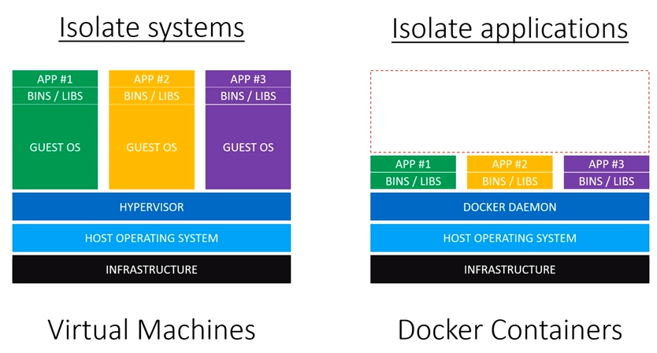

## Module 4 Lesson 6
### Docker

---

### Agenda
1. Deployment Management Evolution
2. VM vs Docker
3. Docker playtime


---
### Deployment Management Evolution
Chapter 1

In the beginning God created the Hardware and the Software.
Now the Web was formless and empty
and darkness was over the sea of Servers.

---
### Deployment Management Evolution
Old school style - Drawbacks?
* Hard to deploy - require installing OS, dependencies etc.
<!-- .element: class="fragment" -->
* Hard to maintain - change in requirements can means change in OS
<!-- .element: class="fragment" -->
* Different versions - different Machines
<!-- .element: class="fragment" -->
* Dev vs Prod - Environments differences are prone for errors
<!-- .element: class="fragment" -->

---
### Deployment Management Evolution
Chapter 2

And God said, “Let there be VM,” and there was VM.
God saw that the VM was good, and he separated the VM from the hosting system
* Easier to deploy - pre-defined images.
<!-- .element: class="fragment" -->
* Easier to maintain - images can be replaced
<!-- .element: class="fragment" -->
* Single machine can run different images
<!-- .element: class="fragment" -->
* Different Hosting systems are not an issue
<!-- .element: class="fragment" -->

---
### Deployment Management Evolution
VM - Drawbacks?
* Creating an OS image can be tedious / expensive
<!-- .element: class="fragment" -->
* Images are heavy - both in RAM and disk space
<!-- .element: class="fragment" -->
* Loading is somewhat slow
<!-- .element: class="fragment" -->

---
### Deployment Management Evolution
Chapter 3

And God said, “Let there be Docker,” and there was [Docker](https://www.docker.com/resources/what-container).
And God saw Docker is awesome.

Docker is Daemon service which run containers - ...
<!-- .element: class="fragment" -->
* Lighter - both in disc space and RAM (big difference when I use cloud services)
<!-- .element: class="fragment" -->
* Faster upload (minutes vs milliseconds)
<!-- .element: class="fragment" -->
* Very open source (larger collection of free systems / dependencies)
<!-- .element: class="fragment" -->


---
### [VM vs Docker](https://www.youtube.com/watch?v=TvnZTi_gaNc)


---
### [VM vs Docker](https://www.youtube.com/watch?v=TvnZTi_gaNc)
So, no need for VM anymore?
* VM have some capabilities which docker does not (especially when it comes to working with hardware)
<!-- .element: class="fragment" -->
* VM is useful when you need even deeper separation (Think of Cloud / Hosting services)
<!-- .element: class="fragment" -->
* For most web app - Docker is more than enough
<!-- .element: class="fragment" -->
* Docker can run with VM
<!-- .element: class="fragment" -->

---
### Docker playtime
* [Install Docker](https://www.docker.com/products/docker-desktop)
* Alternatively use [get-started guide](https://docs.docker.com/get-started/)
* Docker Quickstart Terminal
* Checks:
```
docker -v
docker ps -a
docker run hello-world
docker rm DOCKER_ID
```

---
### Docker playtime

```
docker run -it --name my-app ubuntu 
```
explore flags with 
```
docker run --help
```
* exit with ctrl+p+q / exit, get back with `docker attach CONTAINER`
* when existed, container can restart with `docker start CONTAINER`

---
### Docker [playtime](https://docs.docker.com/engine/reference/commandline/cli/)
```
docker images
docker rmi CONTAINER / docker rmi -f CONTAINER
```

---
### Docker playtime
Option 1 - [pre-defined container](https://gist.github.com/bahmutov/448f73b49914d1981643)

Use the [OFFICIAL REPOSITORY](https://hub.docker.com)
```
docker run --it ubuntu
docker run --rm -d -p 3000:8080 --name my-node-app -v PATH_ON_MY_MACHINE:PATH_ON_CONTAINER -w PATH_ON_CONTAINER node:10 node server.js
```

---
### Docker playtime
Option 2 - [define our container](https://nodejs.org/en/docs/guides/nodejs-docker-webapp/) with a Dockerfile.

Build with with `build` command. Then check image and run it.
```
docker build -t node-web-app .
docker images
docker run -p 4000:3000 -d --name yuval-server node-web-app
```
see [docker-node](https://github.com/nodejs/docker-node/blob/master/README.md#dockerfile) for more info


---

### Further reading
* [Docker Get started parts 1-6](https://docs.docker.com/get-started/part1/)

### Extra:
* [Internet-Israel Docker Guides](https://internet-israel.com/category/%D7%9E%D7%93%D7%A8%D7%99%D7%9B%D7%99%D7%9D/docker/)
* [Learn Docker in 20 Minutes](https://www.youtube.com/watch?v=wCTTHhehJbU)
* [Docker command line](https://docs.docker.com/engine/reference/commandline/cli/)
* [The Difference between RUN and CMD in a Dockerfile](https://nickjanetakis.com/blog/docker-tip-7-the-difference-between-run-and-cmd)
